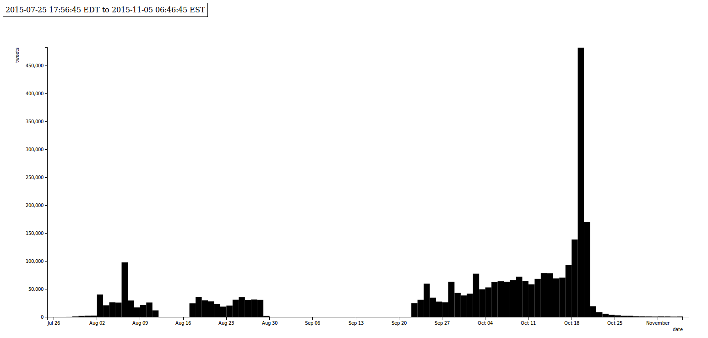
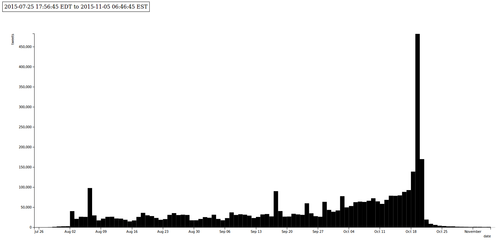
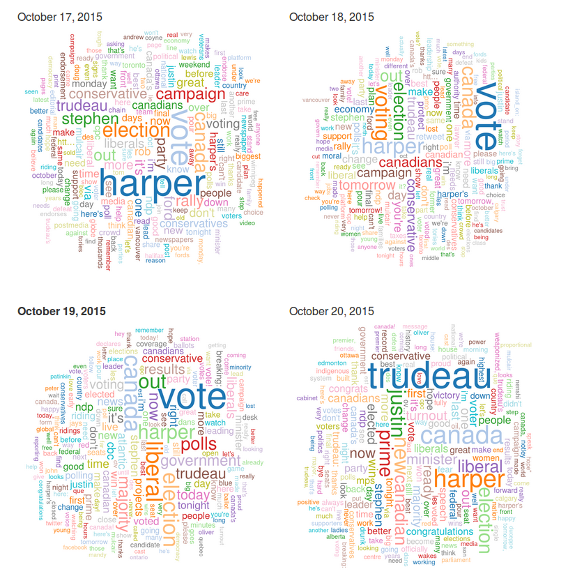

# An Exploratory look at 3,918,932 #elxn42 tweets

Nick Ruest (York University), Ian Milligan (University of Waterloo)

## Abstract

This article examines the tools, approaches, collaboration, and findings of the Web Archives for Historical Research Group around the capture and analysis of about 4M tweets during the 2015 Canadian Federal Election. We hope that national libraries and other institutions will find our model useful as they consider how to archive ongoing events using Twitter.

While Twitter is not a representative sample of broader society - Pew Research notes that it skews young, college-educated, and affluent (above $50,000 household income) – Twitter still represents an exponential increase in the amount of information generated, retained, and preserved from non-elite people. Therefore, when historians study the 2015 federal election, Twitter will be a prime source.

On August 3, 2015, the team initiated both a Search API and Stream API collection with twarc using the hashtag #elxn42. Data collection ceased on November 5, 2015, the day after Justin Trudeau was sworn in as the 42nd Prime Minister of Canada. We collected for a total of 102 days, 13 hours and 50 minutes.

To analyze the data set, we took advantage of a number of utilities that are available within twarc and twarc-report, as well as `jq`, Mathematica, and Apache Spark Notebook. In accordance with the Twitter ToS, we made the tweet IDs and other derivative data available in a data repository.

Our analytics included:

- breaking tweet text down by day to track change over time;
- client analysis, allowing us to see how the scale of mobile devices affected medium interactions;
- URL analysis, comparing both to Archive-It collections and the Wayback Availabilty API to add to our understanding of crawl completeness;
- and image analysis, using an archive of extracted images.

Our article introduces our collecting work, the analysis we have done, and provides a framework for other collecting institutions to do similar work with our off-the-shelf open-source tools.

## Introduction

During the 2015 Canadian federal elections, we captured 3,918,932 tweets written using the #elxn42 hashtag: thoughts on the nature and stature of political candidates or parties, live running commentary during leader debates, exhortations to vote, witty ripostes or jokes to liven up the long campaign. Political scientists, journalists, and other researchers can use these tweets as evidence of sentiment amongst a certain slice of the electorate: did a policy go over well? Did it not? What tweets get re-tweeted, or further shared, and which ones do not? If these are questions that resonate amongst contemporary researchers, historians are also interested in the long-term preservation of digital material. Tweets, as well as the much broader scope of archived webpages and born-digital data, are the primary sources of tomorrow. Websites and tweets present considerable advantages in that they represent the preservation of material representing the voices of everyday people that might not otherwise be saved, but also considerable challenges in the collection and use of data on such a large scale. If the norm until the digital era was to have human information vanish, "now expectations have inverted. Everything may be recorded and preserved, at least potentially" (James Gleick, _The Information: A History, a Theory, a Flood_, 2012). Useful historical information is being preserved at mind-boggling rates that continue to accelerate. IBM Research, for example, notes that "every day, we create 2.5 quintillion bytes of data --- so much that 90% of the data in the world today has been created in the last two years alone."

This data has the potential to reshape multiple avenues of historical research. Social and cultural historians will have access to the thoughts, behaviours, and activities of everyday people, the sorts of which who are not generally preserved in the record. Military historians will have access to the voices of soldiers, posting from overseas missions and their bases at home. And political historians will have a significant opportunity to see how people engaged with politicians and the political sphere, during both elections and between them. The scale boggles. Modern social movements, from the Canadian #IdleNoMore protest focusing on the situation of First Nations peoples to the global #Occupy movement that grew out of New York City, leave the sorts of records that would rarely, if ever, have been kept by previous generations. During the #IdleNoMore protest, for example, twitter witnessed an astounding 55,334 tweets on 11 January 2013. If we were to take the median length of a tweet (60 characters), the average length of a word (5 characters plus a space), and think about 300 words per page, we're looking at over 1,800 pages. For a single day of a single social movement in the relatively small country of Canada.

While Twitter is certainly not a representative sample of broader society - [Pew Research](http://www.pewinternet.org/2015/01/09/demographics-of-key-social-networking-platforms-2/#twitter) shows that it skews young, college-educated, and affluent (above $50,000 household income). We need to keep the demographic limitations of this source base in mind, as we do with all source bases. Yet, Twitter – and other web archives – will still represent an exponential increase in the amount of information generated, retained, and preserved from non-elite people.

Therefore, when historians study the 42nd federal election, Twitter will be a prime source.

But while we recognize Twitter's significance, it calls out for active preservation. Once an event has happened, if a small window of time has passed – 7 to 9 days – the tweets become largely inaccessible on a large scale without considerable monetary resources. While the Library of Congress archives tweets, it remains unclear how their access regime will work. Yet using a combination of several open-source tools, librarians, archivists and other researchers can do the following:

- create their own twitter archives using `twarc`;
- analyse tweets using `twarc-report` and `twarc-utilities`;
- visualize the material;
- use Twitter as a launchpad for further web archiving activities; and
- share tweet IDs with an eye to sharing collections in accordance with the Twitter Terms of Service.

This article walks users through these five steps, with an eye to presenting this as a model for other forms of analysis. Libraries, spread across the world, can collect hashtags of local or national significance, taking a step towards the more widespread preservation of today's cultural record.

## Creating your Own Twitter Archive: Data Collection

The [Web Archives for Historical Research Group](https://uwaterloo.ca/web-archive-group/) began capturing #elxn42 tweets on August 3, 2015 with [twarc](https://github.com/edsu/twarc). "twarc is a command line tool and Python library for archiving Twitter JSON data. Each tweet is represented as a JSON object that is exactly what was returned from the Twitter API. Tweets are stored as line-oriented JSON. It twarc runs in three modes: search, stream and hydrate. When running in each mode twarc will stop and resume activity in order to work within the Twitter API's rate limits."[1]

On August 3, the team initiated both a search API and stream API collection with twarc using the hashtag #elxn42. The search API was used to gather any tweets with the #elxn42 hashtag before initial collection date. The stream collection mode was initiated with the intention to gather #elxn42 tweet for the entirity of the election. However, we noticed that twarc had silently failed during September, and the research team did not notice. As a result we lost 27 days in total. Upon realization of the collection failure, the research team immediately began collecting via the stream API and began search API collection (allows collection back 7-9 days) simultaneously. Data Collection was stopped on November 5, 2015, the day after Justin Trudeau was sworn in as the 42nd Prime Minister of Canada. A total of 102 days, 13hrs and 50 minutes.



In retrospect, the research team recommends using a combination of collection via the search and streaming API. A streaming API collection over the period of the capture, as well weekly search API collections. Then, at the end of data collection concatenating all files together, and deduplicating the entire dataset.

Library and Archives Canada (LAC) also collected the #elxn42 hashtag during a similar time period; August 11, 2015 - October 28, 2015. The team made use of the LAC #elxn42 capture by downloading their tweet id dataset[7], and hydrating it. Once the LAC dataset was hydrated, the team combined their original dataset[4] with the LAC dataset[7], and deduplicated it[6].

```bash
$ twarc.py --hydrate elxn42-tweets-LAC.txt > elxn42-tweets-LAC.json
$ cat elxn42-tweets.json elxn42-tweets-LAC.json > elxn42-tweets-combined.json
$ python ~/git/twarc/utils/deduplicate.py elxn42-tweets-combined.json > elxn42-tweets-combined-deduplicated.json
```



This does not necesasarily mean that between LAC and our research group that we captured all tweets. Driscoll and Walker have shown substantial differences in what is captured using Twitter's commercial Gnip service versus the streaming API.[9] While the #elxn42 hashtag never exceeded the hard limit of 1% of all tweets enacted using the streaming API – which comes into play if the volume of tweets you are downloading exceeds 1%, common in cases such as high-profile events (the Paris shootings or an American presidential debate) - there is still a chance that some content was not collected. 

### How do you collect?

Collecting tweets is very straight forward. Once you install twarc, can collect tweets using the Twitter Stream and Search APIs:

Search API: `twarc.py --search "#elxn42" > elxn42-search.json`

Stream API: `twarc.py --stream "#elxn42" > elxn42-stream.json`

These two APIs complement each other well. The Search API provides historical search on a given query, such as #elxn42, stretching back somewhere between six and nine days of Tweets. Their API cautions that "the Search API is focused on relevance and not completeness. This means that some Tweets and users may be missing from search results."[10]

For completeness, then, we can turn to the Streaming API. This gives "developers low latency access to Twitter's global stream of Tweet data," up to the aforementioned 1% volume.[11]

A combination of the two is a recommended approach: the streaming API for the bulk collection, and the search API to fill in any gaps that may have happened when using the system.

Once collected, tweets can be shared with other people through the tweet IDs, which can be rehydrated using twarc. As twarc's readme notes:

    The Twitter API's Terms of Service prevent people from making large amounts of raw Twitter data available on the Web. The data can be used for research and archived for local use, but not shared with the world. Twitter does allow files of tweet identifiers to be shared, which can be useful when you would like to make a dataset of tweets available. You can then use Twitter's API to hydrate the data, or to retrieve the full JSON for each identifier. This is particularly important for verification of social media research.

The command:

`twarc.py --hydrate elxn42-tweet-ids.txt > elxn42-tweets.json`

will recreate the original tweet(s) in json format, provided the content is still available on Twitter. If you wanted to use our dataset, for example, you could download it at our Scholars Portal [#elxn42 dataverse entry](http://dataverse.scholarsportal.info/dvn/dv/wahr/faces/study/StudyPage.xhtml?globalId=hdl:10864/11311&studyListingIndex=0_4f342bb422cc256e2cf4aeef2d99). If somebody deleted their tweet between the time of our collection and the time of your rehydration, you would not gain access to that content.

## Approach to Analysis

To analyze the data set, we took advantage of a command line utilities, a number of utilities that are available with twarc and twarc-repot, as well as [jq](https://stedolan.github.io/jq/). [twarc-report](https://github.com/pbinkley/twarc-report). twarc-report is a set of utilities "for generating reports from twarc collections using tools such as D3.js."[2] The graphs above were created with twarc-report.

`python ~/git/twarc-report/d3times.py elxn42-tweets-combined-deduplicated.json -a -o embed -t local -i 24H > elxn42-times.html`

Upon completion of capturing #elxn42, the team immediately began aggregating their dataset into a single file. The team began with 12 different line oriented JSON object files totaling 22GB and 4,117,753 undeduplicated tweets. These 12 files were aggregated into a single file: `cat *json > elxn42-tweets.json`. Once aggregated, the dataset was validated with [`validate.py`](https://github.com/edsu/twarc/blob/master/utils/validate.py), and the deduplicated (we have to dedupe giving the combination of search API and stream API collection modes with twarc) using [`deduplicate.py`](https://github.com/edsu/twarc/blob/master/utils/deduplicate.py). Once deduplicated, we were able to come up with the number of tweets collected. Since each tweet is a single JSON object representing a single line in the file, we were able to quickly calculate with simple command line utilities:

```bash
$ cat elxn42-tweets-combined-deduplicated.json | wc -l
3918932
```

Since Twitter automatically shortens URLs, the team also unshortened every URL in the dataset so that we would be able create a canonical list of URLs tweeted for further analysis. We were able to create this using a combination of tools; [`unshorten.py`](https://github.com/edsu/twarc/blob/master/utils/unshorten.py) and [unshrtn](https://github.com/edsu/unshrtn) ("a small leveldb backed URL unshortening microservice written for node")[3].

```bash
$ sudo docker build --tag unshrtn:dev .
$ sudo docker run -p 80:3000 -d -t unshrtn:dev
$ cat elxn42-tweets-combined-deduplicated.json | ~/git/twarc/utils/unshorten.py > elxn42-tweets-combined-deduplicated-unshortened.json
```

With the URLs, we were able to run subsequent analysis: from creating a subsequent web crawl using the corpus in order to launch further explorations of an #elxn42 web crawl, to comparing coverage within the #elxn42 URL corpus with the broader Internet Archive, and beyond. This sort of derivative dataset can be very useful, especially given the URL-centric nature of the Wayback Machine.

### Should You Collect?
Beyond the technical question of how to collect tweets comes the ever-important question of should you, and if so, how to handle the question of consent? Strictly speaking, we have permission in accordance in a "legal sense," thanks to the Twitter Terms of Service. We can only capture public tweets, and given the tweets are public, we interpret that as consent in the broadest form to archive and preserve this material. Consent is not perpetual, as users may decide to make their account "private" after collection. Accordingly, when tweet ids are hydrated, only publicly accessible tweets are hydrated. So, if a tweet is delete in the period between our capture and hydration, the  tweet will not be hydrated. Similarly, if an account is public, and set to private in the period between our capture and hydration, the tweet will not be hydrated.

Legal does not equal ethical, though. As Aaron Bady has noted, "[t]he act of linking or quoting someone who does not regard their twitter as public is only ethically fine if we regard the law as trumping the ethics of consent."[12] As researchers at the University of Southern California discovered with their "Black Twitter Project," many are uncomfortable with the prospect of their online content being harnessed without consent for research projects.[13] 

Yet, if we do not archive this material, it could be lost forever: invaluable, diverse perspectives on unfolding events like the 2015 Canadian federal election. Collecting these tweets raises the prospect of histories not dominated by the mainstream media. We thus collect the material with the proviso that it needs to be ethically used by researchers. As Dorothy Kim and Eunsong Kim put it in their "#TwitterEthics Manifesto," academics and those using this material in their work need to rethink their approach:

>In the end, the work, the credit, the compensation, and the view need to be a shared, collaborative process. Twitter and New Media journalism, the internet and technology involves all of us. The voices on the platform are multiple, collective, dissenting, singular, and loud. You don’t need to speak for us–we are talking. Cite us, ask us to write, get our permission.[14]

We collect the material so that it can be used. Researchers need to be ethically aware. When distributing the Tweet IDs, we encourage them to use this material with respect.

## Data Analysis and Results

### Text
Using `jq`, we extracted all of the plain text of every tweet:

```bash
$ jq (cat elxn42-tweets.json | jq -c '.text' | cat > elxn42-tweets-text.txt)
```

This was useful for working with text analysis software, such as custom scripts written in R, Python, Mathematica, or even using the accessible online platform [Voyant-Tools](http://voyant-tools.org/).

We were also interested in contrasting Twitter data by day, to see how it involves. To do so, we used this following script:

```python
#!/usr/bin/env python
from __future__ import print_function

import sys
import json
import fileinput
import dateutil.parser
import dateutil.rrule
import pytz
import pandas as pd
import datetime
import io

# parse command-line args
eastern = pytz.timezone('US/Eastern')
start_date = dateutil.parser.parse("25-July-2015")
start_date = eastern.localize(start_date)
end_date = dateutil.parser.parse("06-November-2015")
end_date = eastern.localize(end_date)

dates = pd.date_range(start_date, end_date).tolist()

for date in dates:
    date_plus_one = date + pd.DateOffset(1)
    pretty_print = date.to_pydatetime().strftime('%Y%m%d')
    filename = 'elxn42-tweets-' + pretty_print + '.json'
    f = io.open(filename, 'w', encoding='utf-8')

    for line in fileinput.input():
        tweet = json.loads(line)
        created_at = dateutil.parser.parse(tweet["created_at"])
        created_at = created_at.astimezone(eastern)
        if ((created_at >= date) and (created_at < date_plus_one)):
            f.write(unicode(json.dumps(tweet, ensure_ascii=False) + '\n'))

    f.close()
```

Once broken into dates, we could run further analysis. Built into `twarc` is the ability to generate word clouds of tweets, using the following command for example (using the 18 October 2016 data):

```bash
$ python ~/git/twarc/utils/wordcloud.py elxn42-tweets-18-oct-2016.json > wordcloud-18-oct-2016.html
```

While word clouds have considerable limitations, especially in the occulision of context around a given keyword, the simplicity of the visualization - where the more a word appears the larger it is - can find overall trends.

The ensuing results can be seen below:



Here we can see the following transition in the tweets:

- 17 October 2015: We see the keyword "Harper" is the most prominent one, as it was throughout much of the election. As the polarizing, incumbent Prime Minister the election was in some ways a referendum on his leadership.
- 18 October 2015: The day before election day. Vote becomes the most prominent, as people want exhort people to be ready for the polls. No one political party dominates, but the word "conservative" remains the most frequent.
- 19 October 2015: Election day. We see Vote dominate, as well as the word "Liberal." This was mostly reflecting the widely retweeted announcement of the Liberal Party of Canada's victory that evening.
- 20 October 2015: The new Prime Minister Trudeau is the topic of the day, as well as his first name: "Justin."

At a glance, we are seeing a major narrative within the tweets.

### Retweets

Most retweeted tweets:

Using `retweets.py` from twarc utilities:
```bash
$ python ~/git/twarc/utils/retweets.py elxn42-tweets-combined-deduplicated.json > elxn42-tweets-retweets.json
$ python ~/git/twarc/utils/tweet_urls.py elxn42-tweets-combined-deduplicated.json > elxn42-tweets-retweets.txt
```

|      | Retweets       | Tweet                                                         |
|-----:|---------------:|---------------------------------------------------------------|
| 1.   | 5483           | https://twitter.com/JustinTrudeau/status/656342399854223360   |
| 2.   | 2104           | https://twitter.com/globalnews/status/655983013168336897      |
| 3.   | 2104           | https://twitter.com/CBCAlerts/status/656283780152479744       |
| 4.   | 1999           | https://twitter.com/CTVNews/status/656283368863223808         |
| 5.   | 1808           | https://twitter.com/22_Minutes/status/655902459769004032      |
| 6.   | 1760           | https://twitter.com/VancityReynolds/status/656355980997881856 |
| 7.   | 1541           | https://twitter.com/pmharper/status/655828288594669569        |
| 8.   | 1456           | https://twitter.com/TheAdamChristie/status/656228806118789120 |
| 9.   | 1421           | https://twitter.com/west_ender/status/656295500765761537      |
| 10.  | 1417           | https://twitter.com/JustinTrudeau/status/655912460101152768   |

### Geographic infomaration

5,370 out of #elxn42 3,918,932 tweets (0.14%) had geographic information associated with them. We were able to determine this by utilizing [`geo.py`](https://github.com/edsu/twarc/blob/master/utils/geo.py) and simple command line utilities:

Using `geo.py` from twarc utilities:
```bash
$ python ~/git/twarc/utils/geo.py elxn42-tweets-combined-deduplicated.json > elxn42-tweets-with-geo.json
$ cat elxn42-tweets-with-geo.json | wc -1
5370
```
We were also able to create a [geojson](geojson.org) file of all the tweets with geographic information associated with them. With this geojson file, we were then able to map the tweets fairly simpy with [Leaflet.js](http://leafletjs.com).

Using `geojson.py` from twarc utilities:
```bash
$ python ~/git/twarc/utils/geojson.py elxn42-tweets-combined-deduplicated.json > elxn42-tweets.geojson
```
Place holder for now: https://gist.github.com/ruebot/6f1960198c3dbf92ae6d or http://ruebot.net/page/elxn42-tweets-map

Can't embed all the HTML and javascript in here. Maybe we can pull this off with Code4Lib Journal if it is published. **Let's embed them!**

### Users

We are able to create a list of the unique Twitter usernames in our dataset by using [`users.py`](https://github.com/edsu/twarc/blob/master/utils/users.py), and additionally sort them by the number of tweets:

Using `users.py` from twarc utilities:
```bash
$ python ~/git/twarc/utils/users.py elxn42-tweets-combined-deduplicated.json > elxn42-tweets-users.txt
$ cat elxn42-tweets-users.txt | sort | uniq -c | sort -n > elxn42-tweets-uniq-users.txt
$ cat elxn42-tweets-uniq-users.txt | wc -l
$ tail elxn42-tweets-uniq-users.txt
```

Using `jq`:
```bash
$ cat elxn42-tweets-combined-deduplicated.json | jq -r '[.user.name, .user.screen_name] | @csv' | elxn42-tweets-users.txt
$ cat elxn42-tweets-users.txt | sort | uniq -c | sort -n > elxn42-tweets-uniq-users.txt
$ cat elxn42-tweets-uniq-users.txt | wc -l
$ tail elxn42-tweets-uniq-users.txt
```

From the above, we can see that there are 318,176 unique users in the dataset, and the top 10 accounts were as follows:

|      | Tweets | Username          |
|-----:|-------:|:-----------------:|
| 1.   | 21423  | DavidMorrison17   |
| 2.   | 15527  | P_Wog             |
| 3.   | 10812  | chuddles11        |
| 4.   | 10051  | 444_nal4b         |
| 5.   | 8871   | JoanneCangal      |
| 6.   | 8346   | littleshasta      |
| 7.   | 8316   | MadeInCanada56    |
| 8.   | 8114   | LucMatte9         |
| 9.   | 7360   | Frazzling         |
| 10.  | 7019   | StopHarperToday   |

Two of the accounts, StopHarperToday and 444_nal4b (a spam account), no longer exist. We discuss this in our deletion section below.

### Hashtags

We were able to create a list of the unique tags using in our dataset by using [`tags.py`](https://github.com/edsu/twarc/blob/master/utils/tags.py).

Using `tags.py` from twarc utilities:
```bash
$ python ~/git/twarc/utils/tags.py elxn42-tweets-combined-deduplicated.json > elxn42-tweet-tags.txt
$ cat elxn42-tweet-tags.txt | wc -l
$ head elxn42-tweet-tags.txt
```

From the above, we can see that there were 70,112 unique hashtags were used. The top 10 hashtags used in the dataset were:

|      | Tweets    | Hashtag        |
|-----:|----------:|:--------------:|
| 1.   | 3,685,885 | #elxn42        |
| 2.   | 1,390,783 | #cdnpoli       |
| 3.   | 164,339   | #ndp           |
| 4.   | 139,070   | #cpc           |
| 5.   | 129,082   | #lpc           |
| 6.   | 89,303    | #elxn2015      |
| 7.   | 68,387    | #polcan        |
| 8.   | 64,718    | #realchange    |
| 9.   | 62,282    | #polqc         |
| 10.  | 61,700    | #globedebate   |

### URLs

We are able to create a list of the unique URLs tweeted in our dataset by using [`urls.py`](https://github.com/edsu/twarc/blob/master/utils/urls.py), after first unshortening the urls as described in the "Approach to Analysis" section.

Using `urls.py` from twarc utilities:
```bash
$ python ~/git/twarc/utils/urls.py elxn42-tweets-combined-deduplicated-unshortened.json > elxn42-tweets-urls.txt
$ cat elxn42-tweets-urls.txt | sort | uniq -c | sort -n > elxn42-tweets-urls-uniq.txt
$ cat elxn42-tweets-urls.txt | wc -l
$ cat elxn42-tweets-urls-uniq.txt | wc -l
$ tail elxn42-tweets-urls-uniq.txt
```

From the above, we can see that there were 1,988,693 URLs tweeted, representing 50.75% of total tweets, and 334,841 unique URLs tweeted. The top 10 URLs tweeted were as follows:

|      | Tweets | URL                                                                       |
|-----:|-------:|---------------------------------------------------------------------------|
| 1.   | 11956  | http://www.cbc.ca/includes/federalelection/dashboard/index.html           |
| 2.   |  9712  | http://www.conservative.ca/                                               |
| 3.   |  4562  | http://www.votetogether.ca/                                               |
| 4.   |  3983  | http://www.cbc.ca/news/politics/macleans-debate-leaders-2015-1.3182000    |
| 5.   |  3926  | http://www.elections.ca/Scripts/vis/FindED?L=e&QID=-1&PAGEID=20           |
| 6.   |  3104  | http://www.elections.ca/home.aspx                                         |
| 7.   |  2812  | http://www.theglobeandmail.com/try-it-now/?articleId=26875323             |
| 8.   |  2808  | https://www.facebook.com/abu.nawaf.581/posts/10206977713713332?pnref=stor |
| 9.   |  2757  | http://dont-be-a-fucking-idiot.ca/                                        |
| 10.  |  2707  | https://www.mypayingads.com/index.php?ref=51826                           |


We were also curious how many domains were tweeted. This required two steps. First, taking a text file of the URL list and then extracting only the domain:

```bash
#!/bin/bash
while read p; do
  echo $p | awk -F/ '{print $3}'
done < elxn42-tweets-urls-fixed.txt > domains-all.txt
```

And then subsequently normalizing by removing sub-domains, so that `m.youtube.com` and `youtube.com` were both simply recorded as `youtube.com`.

```bash
#!/bin/bash
while read l; do
  (sed 's/.*\.\(.*\..*\)/\1/' <<< ${l%/*})
done < domains-all.txt > normalized-domains-all.txt
```

And generating sorted frequency lists with:

```bash
sort normalized-domains-all.txt | uniq -c | sort -nr > normalized-domains-all-sorted.txt
```

The top 10 domains that were tweeted were as follows:

|      | Tweets  | Domain                |
|-----:|--------:|:---------------------:|
| 1.   | 615421  | twitter.com           |
| 2.   | 143941  | cbc.ca                |
| 3.   | 66886   | youtube.com           |
| 4.   | 66758   | huffingtonpost.ca     |
| 5.   | 63401   | theglobeandmail.com   |
| 6.   | 53051   | thestar.com           |
| 7.   | 49295   | ctvnews.ca            |
| 8.   | 46488   | globalnews.ca         |
| 9.   | 39989   | twimg.com             |
| 10.  | 35280   | macleans.ca           |

**This paragraph needs a re-write given updated data**
We can get a sense of how social media shapes what people share, although old legacy media was surprisingly well-represented in the Canadian context: the Canada Broadcast Corporation (especially their election day dashboard), the two highest-circulation newspapers the *Globe and Mail* and *Toronto Star*, and popular television networks CTV and Global News. While the *Huffington Post*'s Canadian edition made an appearance, we were surprised by the degree to which traditional media dominated.

The domains shared also affected their permanent archiving. By comparing this list of unique URLs to the Internet Archive's [Wayback Availability JSON API](https://archive.org/help/wayback_api.php), which takes a user-provided URL and determines whether there is an archived, accessible copy in the main [Wayback Machine](http://archive.org/web), we found that of the 263,708 unique URLs, 221,491 were not found. This gives the Wayback Machine a coverage rate of 16.01% in our corpus. This is largely due to the domains that are largely excluded from the Wayback Machine: Twitter, Facebook, and YouTube, for example.

Given that there would be a delay between now and when the websites are included in the Wayback Machine – in many cases between six and 24 months – this is reasonable coverage (Ainsworth et al, 2013). We plan to periodically revisit these results at quarterly intervals, to see how quickly these URLs are ingested into the Wayback Machine.

This will help contribute to a growing body of literature around how many URLs are actually included in the Wayback Machine.

### Embedded images

We are able to create a list of images tweeted in our dataset by using [`image_urls.py`](https://github.com/edsu/twarc/blob/master/utils/image_urls.py).

Using `image_urls.py` from twarc utilities:
```bash
$ python ~/git/twarc/utils/image_urls.py elxn42-tweets-deduped.json > elxn42-tweets-images.txt
$ cat elxn42-tweets-images.txt | sort | uniq -c | sort -n > elxn42-tweets-images-uniq.txt
$ cat elxn42-tweets-images.txt | wc -l
$ cat elxn42-tweets-images-uniq.txt | wc -l
$ tail elxn42-tweets-images-uniq.txt
```

Using `jq`:
```bash
$ cat elxn42-tweets-deduped.json | jq -r '.entities | select(.media != null) | .media[].media_url_https' | cat > elxn42-tweets-images.txt
$ cat elxn42-tweets-images.txt | sort | uniq -c | sort -n > elxn42-tweets-images-uniq.txt
$ cat elxn42-tweets-images.txt | wc -l
$ cat elxn42-tweets-images-uniq.txt | wc -l
$ tail elxn42-tweets-images-uniq.txt
```

From the above, we can see that there were 1,203,867 total images tweets, representing 30.72% of total tweets, and 176,513 unique images. The top 10 images tweeted were as follows:

|      | Tweets  | Image                                                                                             |
|-----:|--------:|:-------------------------------------------------------------------------------------------------:|
| 1.   | 5111    |  |
| 2.   | 2247    |  |
| 3.   | 1975    |  |
| 4.   | 1968    |  |
| 5.   | 1895    |  |
| 6.   | 1478    |  |
| 7.   | 1376    |  |
| 8.   | 1357    |  |
| 9.   | 1346    |  |
| 10.  | 1206    |  |

### Deleted Tweets

As mentioned above, twarc has a mode called "hydrate". Hydrate allows a user to a take a set of tweet ids -- in this case you can use the data set we are working with here[4] -- and hydrate the tweets ids with the full tweet from the Twitter API. This process can be slow since, "Twitter limits users to 180 API requests every 15 minutes. Each request can hydrate (Twitter’s term for turning a Twitter up to 100 Tweet IDs using the statuses/lookup REST API call. So `80 requests * 100 tweets = 18,000 tweets/15 min = 72,000 tweets/hour`[5]." In our case, we began hydrating on November 21, and finished on November 23. The process took a little over 39 hours. In the end, we had a total of 2,832,270 tweets. Which means that 207,534 tweets deleted, giving us a 7.33% tweet churn.

Terms of service prevent us from going into much detail on the deleted users, but several significant users were deleted. One, StopHarperToday, no longer exists as of writing. And another major account, 444_nal4b, appears to be a spammer account that extensively tweeted on the #elxn42 hashtag. While Twitter's user experience is arguably enhanced by the loss of spam tweets, they are an essential part of the Twitter experience and it is worth nothing that they may be significantly reduced in rehydrated Twitter databases. Future historians may have difficulty studying the online advertisements of our day.

We can go further here if you'd like.

http://inkdroid.org/2015/04/14/tweets-and-deletes/
https://medium.com/on-archivy/on-forgetting-e01a2b95272

* StopHarperToday -- doesn't exist anymore
* 444_nal4b -- appears to be spam

**Should we try to look for any patterns in the difference list? Should we also double up the analysis about, and see if there is any odd things?**
**TODO -- Nick needs to create a diff of ids**

## Integrating Twitter Archiving with Web Archiving

There are also fruitful opportunities for integrating this form of Twitter archiving and analysis with other approaches to web archiving. Our team has a complementary undertaking, the [WebArchives.ca](http://webarchives.ca/) portal, which enables citizen access to large Canadian political web archives.

The Canadian Political Parties and Political Interest Groups (CPP) collection is a key example of these sorts of collections. The CPP collection is of national interest in Canada, covering some fifty groups ranging from the major political parties of Canada, the minor ones, political interest groups, and some coverage. Collected quarterly, and occasionally more frequently during federal elections, it is an invaluable record of public, political life. In the lead up to the 2015 federal election, we received almost 30,000 page views and some 3,000 individual distinct users. It also received significant media attention in the Canadian Broadcasting Corporation, including on several national programs.

This collection, however, has a significant downside: its limited seed list.

Of the 263,708 unique URLs, we checked each against the list of fifty domains to see which of the URLs tweeted would have been included in the UTL collection. 46,778, or 17.7%, were part of the fifty top-level domains. On the #elxn42 hashtag then, 82.3% of URLs that were tweeted would not have been included in the formal CPP collection.

This might speak to a new collection strategy?

Note for writing: I created this list by getting a list of the 50 domains, the list of the URLs used, and running `grep -wFf Webarchives-domains.md elxn42-tweets-urls-uniq.txt > intersections.txt`.

## Conclusion

This paper has outlined a light-weight and open-source method of collecting and analyzing Twitter events. The case study of the 2015 Canadian federal election hashtag, #elxn42, is roughly analogous to other medium-scale, longitudinal events: it lacked the severe spikes and pitfalls of an event such as the Paris shootings or an American election (in which case a commercial approach would be necessary for full scoping). Yet it is a perfect fit for many events of interest to libraries, archives, and special collections.

Beginning by identifying a hashtag of interest, `twarc` can be used to assemble a full dataset of tweets. `twarc-report`, `twarc`'s utilities, and other tools discussed here can all give users a rough sense of what happened within the collection. These distant reading approaches could help isolate particular days, users, or popular tweets for researchers to study. They could not read all four million tweets, but they could use these tools to find the right ones to investigate further. While Twitter's Terms of Service prevent the wholescale sharing of the collected data itself, rosters of Tweet IDs can be easily shared using institutional repositories or other sharing platforms, allowing other users to "rehydrate" their own tweets. While this has the downside of removing tweets deleted until the moment of rehydration, this allows one to continually monitor "churn" within a collection.

In an era where web archiving and twitter collection can be seen as expensive luxuries, this paper shows how for a relatively small investment of computing power, bandwidth, and storage, people can create and analyze their own Twitter archives. We hope that our #elxn42 experience can serve as an illustrative model.

## References

[1]: http://dx.doi.org/10.5281/zenodo.31919 "Ed Summers, Hugo van Kemenade, Peter Binkley, Nick Ruest, recrm, Stefano Costa, Eric Phetteplace, et al. ‘Twarc: v0.3.4.’ Zenodo, 2015. doi:10.5281/zenodo.31919."
[2]: https://github.com/pbinkley/twarc-report "Peter Binkley. 'twarc-report' GitHub, 2015. https://github.com/pbinkley/twarc-report"
[3]: https://github.com/edsu/unshrtn "Ed Summers, Daniel Krech. 'unshrtn' GitHub, 2015. https://github.com/edsu/unshrtn"
[4]: http://hdl.handle.net/10864/11270 "Nick Ruest, '#elxn42 tweets', http://hdl.handle.net/10864/11270 V2 [Version]"
[5]: https://medium.com/on-archivy/on-forgetting-e01a2b95272 "Ed Summers, 'On Forgetting and hydration', https://medium.com/on-archivy/on-forgetting-e01a2b95272"
[6]: http://hdl.handle.net/10864/11311 "Nick Ruest, Library and Archives Canada, 2015-12-07, #elxn42 tweets (42nd Canadian Federal Election), http://hdl.handle.net/10864/11311 V1 [Version]"
[7]: http://hdl.handle.net/10864/11310 "Library and Archives Canada, #elxn42 tweets (42nd Canadian Federal Election), http://hdl.handle.net/10864/11310 V3 [Version]""
[8]: http://arxiv.org/abs/1212.6177 "Ainsworth, Scott G., Ahmed AlSum, Hany SalahEldeen, Michele C. Weigle, and Michael L. Nelson. “How Much of the Web Is Archived?” arXiv:1212.6177 [cs], December 26, 2012. http://arxiv.org/abs/1212.6177"
[9]: http://ijoc.org/index.php/ijoc/article/view/2171/1159 "K. Driscoll and S. Walker, “Big Data, Big Questions| Working Within a Black Box: Transparency in the Collection and Production of Big Twitter Data,” International Journal of Communication, vol. 8, no. 0, p. 20, Jun. 2014.""
[10]: https://dev.twitter.com/rest/public/search "Twitter, 'Search API,' https://dev.twitter.com/rest/public/search"
[11]: https://dev.twitter.com/streaming/overview "Twitter, 'Streaming API, https://dev.twitter.com/streaming/overview"
[12]: http://thenewinquiry.com/blogs/zunguzungu/notallpublic-heartburn-twitter/ "A. Bady, #NotAllPublic, Heartburn, Twitter, 10 June 2014, http://thenewinquiry.com/blogs/zunguzungu/notallpublic-heartburn-twitter/, last accessed 16 June 2015"
[13]: http://www.cbc.ca/newsblogs/yourcommunity/2014/09/universitys-black-twitter-study-generates-controversy.html "Lauren O'Neil, "University's 'Black Twitter' study generates controversy," 4 September 2014, http://www.cbc.ca/newsblogs/yourcommunity/2014/09/universitys-black-twitter-study-generates-controversy.html."
[14]: https://modelviewculture.com/pieces/the-twitterethics-manifesto "Dorothy Kim and Eunsong Kim, "The #TwitterEthics Manifesto," 7 April 2014, https://modelviewculture.com/pieces/the-twitterethics-manifesto."

* Ed Summers, Hugo van Kemenade, Peter Binkley, Nick Ruest, recrm, Stefano Costa, Eric Phetteplace, et al. ‘Twarc: v0.3.4.’ Zenodo, 2015. doi:10.5281/zenodo.31919.
* Peter Binkley. 'twarc-report' GitHub, 2015. https://github.com/pbinkley/twarc-report
* Ed Summers, Daniel Krech. 'unshrtn' GitHub, 2015. https://github.com/edsu/unshrtn
* Nick Ruest, '#elxn42 tweets', http://hdl.handle.net/10864/11270 V2 [Version]
* Ed Summers, 'On Forgetting and hydration', https://medium.com/on-archivy/on-forgetting-e01a2b95272
* Nick Ruest, Library and Archives Canada, 2015-12-07, #elxn42 tweets (42nd Canadian Federal Election), http://hdl.handle.net/10864/11311 V1 [Version]
* Library and Archives Canada, #elxn42 tweets (42nd Canadian Federal Election), http://hdl.handle.net/10864/11310 V3 [Version]"
* Ainsworth, Scott G., Ahmed AlSum, Hany SalahEldeen, Michele C. Weigle, and Michael L. Nelson. "How Much of the Web Is Archived?" arXiv:1212.6177 [cs], December 26, 2012. http://arxiv.org/abs/1212.6177
* K. Driscoll and S. Walker, "Big Data, Big Questions| Working Within a Black Box: Transparency in the Collection and Production of Big Twitter Data," International Journal of Communication, vol. 8, no. 0, p. 20, Jun. 2014.
